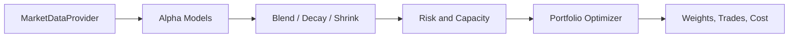

# ai_qre

Quant Research Environment built by AI

## References

- https://docs.google.com/document/d/e/2PACX-1vTPgw9iql2uq-7aQ7tLcsfYSZ7Ymv9m8rMZCYEQhpje8D6fs3R_0MVbdjUIXK6M67XrePgZEIHGW_LQ/pub

---

## Overview

**ai_qre** is a quantitative research environment that takes alpha signals through a single-period portfolio optimization pipeline and supports backtesting, stress testing, experiment tracking, and distributed research. You supply a **data provider** and **alpha models**; the pipeline handles blending, risk, capacity limits, optimization, and execution cost. It is designed for research and production-style portfolio construction (e.g. long/short equity) with configurable constraints and risk controls.

---

## Architecture and data flow

The public API has two entry points:

- **`ResearchPipeline`** – Main path: data → alpha blend/decay/shrink → risk and capacity → optimizer → weights, trades, and execution cost.
- **`ResearchExtensions`** – Facade over advanced utilities: Barra-like risk, cross-sectional regression, walk-forward backtest, vectorized backtest, Monte Carlo stress, distributed runner, and experiment tracking.

Both live in `ai_qre` (see `ai_qre/__init__.py`). The core flow is implemented in `ai_qre/research_pipeline.py`.



**Types and protocols** let you plug in custom data and alpha:

- **Type aliases** (`ai_qre/types.py`): `AlphaVector` (ticker → score), `AlphaModelMap` (model name → AlphaVector), `WeightVector`, `TradeVector`, `FactorExposureMap` (date → exposure DataFrame).
- **Protocols**: `CovarianceProvider` (`types.py`: `compute(tickers) -> np.ndarray`); the optimizer and resampling use it. `MarketDataProvider` is defined in `ai_qre/data/provider.py`; `MarketDataProviderLike` in `types.py` is the protocol name used in type hints. `ResearchPipelineLike` (build_portfolio), `AlphaGeneratorLike` (train_returns → AlphaModelMap).

Implement `MarketDataProviderLike` for your data source; pass `AlphaModelMap` into `build_portfolio`; use `AlphaGeneratorLike` with the walk-forward backtester.

---

## Pipeline step-by-step

The pipeline is a fixed sequence. Each step is described below.

### 1. Data

You must provide a **market data provider** that matches the `MarketDataProvider` protocol in `ai_qre/data/provider.py`:

- `get_prices(tickers, start?, end?)` → DataFrame (dates × tickers)
- `get_returns(tickers, lookback=252)` → DataFrame (default implementation uses prices and pct_change)
- `get_volumes(tickers)` → DataFrame
- `get_sectors(tickers)` → Mapping[ticker, sector]
- `get_market_caps(tickers)` → Mapping[ticker, float]

`example_usage.py` defines a `MockData` class that implements this contract; use it as a reference or for testing.

### 2. Alpha

Produce an **alpha model map**: a dict of model name → `AlphaVector` (ticker → score). The pipeline then:

- **Blends** all models with optional per-model weights via `AlphaBlender` (in `ai_qre/alpha/transforms.py`).
- **Decays** the combined alpha by age using `AlphaDecay` (half-life in days).
- **Shrinks** toward a prior mean via `shrink()`.

You can also use `CrossSectionalAlphaModel` in `ai_qre/alpha/cross_sectional_regression.py` to fit cross-sectional OLS/ridge (signals → future returns) and then produce an alpha vector from predictions.

### 3. Risk

The pipeline uses:

- **`ShrinkageCovariance`** (`ai_qre/risk/covariance.py`) – Sample covariance of historical returns with diagonal shrinkage for the optimizer.
- **`BarraLikeRiskModel`** (`ai_qre/risk/barra_model.py`) – Optional factor exposures (market_beta, size, momentum, sector dummies) for factor penalty and hard neutralization.

Risk behavior is configured by `RiskConfig` in `ai_qre/config.py`: `shrinkage`, `factor_window`, `momentum_lookback`, `min_obs`.

### 4. Capacity

If `portfolio_config.use_capacity_limits` is True, **`LiquidityModel`** (`ai_qre/capacity/liquidity.py`) computes per-asset max weight limits from:

- Average daily dollar volume (ADDV)
- Participation cap and forecast days to liquidate
- AUM

These limits are passed into the optimizer as per-asset upper bounds. `CapacityConfig` in `config.py` sets `adv_fraction`, `participation_cap`, `forecast_days_to_liquidate`, `min_weight_cap`.

### 5. Optimization

**`PortfolioOptimizer`** (`ai_qre/portfolio/optimizer.py`) takes a **CovarianceProvider** (e.g. `ShrinkageCovariance`) and solves a single-period convex problem (CVXPY, default solver OSQP):

- **Objective type** (`objective_type`): `"mean_variance"` (default), `"gmv"`, `"cvar"`, `"tracking_error"`, `"robust_mv"`. Mean–variance form: alpha · w − risk_aversion × w'Σw − turnover_penalty × |w − w_current| − factor_penalty × ‖exposure'w‖².
- **Resampled efficiency**: When `use_resampled_efficiency` is True, the optimizer uses Michaud-style resampled weights (`ai_qre/portfolio/resampling.py`) instead of a single QP solve.
- **Black–Litterman**: When `use_black_litterman` and `bl_views` are set, the pipeline applies `posterior_expected_returns` to alpha before the optimizer.
- **Trading cost in objective**: Optional `use_trading_cost_in_objective`; per-asset quadratic cost from `LiquidityModel.trading_cost_impact_diag` is passed into the optimizer.
- **Constraints**: net exposure = net_target, gross exposure ≤ gross_limit, per-asset bounds (and optional capacity-based caps), optional hard factor/sector neutrality, optional turnover limit.

All optimizer knobs are on `PortfolioConfig`: `max_position`, `gross_limit`, `net_target`, `turnover_penalty`, `risk_aversion`, `factor_penalty`, `sector_neutral`, `hard_factor_neutral`, `neutral_factors`, `factor_tolerance`, `max_names`, `solver`, `objective_type`, `use_resampled_efficiency`, `resampled_simulations`, `resampled_seed`, `use_black_litterman`, `bl_*`, `use_trading_cost_in_objective`, `trading_cost_impact`, `turnover_limit`, etc.

### 6. Output

The pipeline returns:

- **Weights** (ticker → weight)
- **Trades** (ticker → weight change from current)
- **Execution cost** from `ExecutionSimulator` (`ai_qre/execution/simulator.py`): per-trade cost = spread × size + impact × size²; portfolio cost = sum over trades.

**MPC**: `build_portfolio_mpc(...)` uses multi-period optimization (`ai_qre/portfolio/multi_period.py`) and returns the same (weights, trades, cost) shape for the first period.

To go from weights to share counts: use `weights_to_shares(weights, aum, prices)` and `shares_to_long_short(shares)` from `ai_qre/utils/position_sizing.py`.

---

## Module reference

| Area             | File(s)                         | Purpose                                                                                                                                                                                       |
| ---------------- | ------------------------------- | --------------------------------------------------------------------------------------------------------------------------------------------------------------------------------------------- |
| **Root**         | `config.py`                     | Dataclasses for portfolio, risk, execution, walk-forward, stress, distributed, capacity, experiment, vectorized research config.                                                              |
|                  | `types.py`                      | Type aliases (AlphaVector, AlphaModelMap, WeightVector, TradeVector, FactorExposureMap) and protocols (CovarianceProvider, MarketDataProviderLike, ResearchPipelineLike, AlphaGeneratorLike). |
|                  | `research_pipeline.py`          | Main pipeline: data, alpha blend/decay/shrink, covariance, Barra-like risk, liquidity, optimizer, execution cost; build_portfolio and build_portfolio_mpc.                                    |
|                  | `research_extensions.py`        | Facade: Barra risk, cross-sectional alpha model, walk-forward backtester, vectorized harness, stress, distributed runner, experiment tracker.                                                 |
| **alpha/**       | `transforms.py`                 | AlphaBlender, AlphaDecay, shrink(), orthogonalize().                                                                                                                                          |
|                  | `cross_sectional_regression.py` | CrossSectionalAlphaModel (OLS/ridge), RegressionResult.                                                                                                                                       |
| **backtest/**    | `backtester.py`                 | Backtester: static weights vs returns → equity curve.                                                                                                                                         |
|                  | `portfolio_env.py`              | PortfolioEnv (RL-style reset/step), build_state, default_reward_fn.                                                                                                                           |
|                  | `vectorized.py`                 | VectorizedResearchHarness: alpha time series → rebalanced weights → portfolio returns and equity; optional top_n/bottom_n, gross, per-date factor neutralization.                             |
|                  | `walk_forward.py`               | WalkForwardBacktester: rolling train/test, alpha generator, pipeline.build_portfolio, turnover and cost tracking.                                                                             |
| **capacity/**    | `liquidity.py`                  | LiquidityModel: ADDV, max_weight_limits, capacity_report, trading_cost_impact_diag.                                                                                                           |
| **data/**        | `provider.py`                   | MarketDataProvider protocol.                                                                                                                                                                  |
| **execution/**   | `simulator.py`                  | ExecutionSimulator: per-trade and portfolio cost (spread + impact).                                                                                                                           |
| **portfolio/**   | `optimizer.py`                  | PortfolioOptimizer: single-period QP (CovarianceProvider, multiple objective types, resampled path).                                                                                          |
|                  | `resampling.py`                 | resampled_efficiency_weights: Michaud-style resampled efficiency.                                                                                                                             |
|                  | `objectives.py`                 | MeanVariance, GMV, CVaR, TrackingError, RobustMeanVariance objective builders.                                                                                                                |
|                  | `constraints.py`                | basic_exposure_constraints (net, gross, bounds, turnover limit).                                                                                                                              |
|                  | `black_litterman.py`            | posterior_expected_returns (BL views → adjusted alpha).                                                                                                                                       |
|                  | `multi_period.py`               | solve_mpc_first_period (MPC first-period weights).                                                                                                                                            |
| **risk/**        | `covariance.py`                 | ShrinkageCovariance (CovarianceProvider).                                                                                                                                                     |
|                  | `barra_model.py`                | BarraLikeRiskModel, FactorRiskSnapshot.                                                                                                                                                       |
|                  | `factor_model.py`               | SimpleFactorModel (market beta only).                                                                                                                                                         |
| **tracking/**    | `experiment.py`                 | ExperimentRun (log*params, log_metrics, log_artifact*\*, finalize), ExperimentTracker (start_run).                                                                                            |
| **stress/**      | `monte_carlo.py`                | MonteCarloStress: simulate paths, terminal value, drawdown, VaR/CVaR stats.                                                                                                                   |
| **distributed/** | `runner.py`                     | DistributedResearchRunner: multiprocessing pool (run, starmap).                                                                                                                               |
| **utils/**       | `position_sizing.py`            | weights_to_shares, shares_to_long_short.                                                                                                                                                      |
|                  | `logging.py`                    | init_structured_logging, get_logger, structlog configuration.                                                                                                                                 |

---

## Models and approaches supported

- **Alpha**: Multiple alpha models combined with `AlphaBlender` (configurable per-model weights). Optional `AlphaDecay` (half-life) and `shrink()` (prior-mean shrinkage). `CrossSectionalAlphaModel` for cross-sectional OLS/ridge (signals → future returns).
- **Covariance / risk**: Sample covariance with diagonal shrinkage (`ShrinkageCovariance`). Barra-like factor model: market_beta, size, momentum, sector dummies; factor covariance and full asset covariance via `BarraLikeRiskModel.snapshot`. Simple market-beta model in `SimpleFactorModel`.
- **Portfolio**: Single-period optimization with multiple objective types (mean–variance, GMV, CVaR, tracking error, robust MV); optional resampled efficiency (Michaud), Black–Litterman alpha adjustment, and trading cost in objective; constraints on net, gross, per-asset caps, optional hard factor/sector neutrality, capacity-driven limits, turnover limit; optional max names. MPC via `build_portfolio_mpc` for multi-period first-period weights.
- **Backtest**: (1) **Backtester**: static weight vector vs return series → equity curve. (2) **VectorizedResearchHarness**: alpha DataFrame + returns DataFrame → rebalance every N days → weights, portfolio returns, equity, turnover; optional top_n/bottom_n, gross scaling, per-date factor neutralization. (3) **WalkForwardBacktester**: rolling train/test windows, `AlphaGeneratorLike` produces alphas from train returns, `ResearchPipelineLike.build_portfolio` at each rebalance; tracks equity, weights, turnover, cost.
- **Execution**: Linear spread plus quadratic impact per trade; portfolio cost = sum of per-trade costs.
- **Stress**: Monte Carlo over multivariate normal returns; outputs terminal PnL distribution, max drawdown, and VaR/CVaR (95%) statistics.
- **Experiments**: File-based run directory: params, metrics, artifacts, summary.json via `ExperimentTracker` and `ExperimentRun`.

---

## Configuration

### Configurable via config dataclasses (`ai_qre/config.py`)

- **PortfolioConfig**: max_position, gross_limit, net_target, turnover_penalty, risk_aversion, factor_penalty, borrow_cost_penalty, sector_neutral, max_names, solver, hard_factor_neutral, neutral_factors, factor_tolerance, use_capacity_limits, aum; objective_type, benchmark_weights, uncertainty_radius, uncertainty_type; use_resampled_efficiency, resampled_simulations, resampled_seed; use_black_litterman, bl_tau, bl_omega_scale, bl_views; use_trading_cost_in_objective, trading_cost_impact, turnover_limit.
- **RiskConfig**: shrinkage, factor_window, momentum_lookback, min_obs.
- **ExecutionConfig**: spread_cost, impact_coeff (ExecutionSimulator itself takes spread/impact in its constructor, not this dataclass).
- **WalkForwardConfig**: train_window, test_window, step_size, rebalance_every, min_history; use_mpc, mpc_horizon, mpc_discount.
- **StressTestConfig**: paths, horizon, seed.
- **DistributedConfig**: workers, chunksize.
- **CapacityConfig**: adv_fraction, participation_cap, forecast_days_to_liquidate, min_weight_cap.
- **ExperimentConfig**: root_dir, autosave_metrics, autosave_params, autosave_artifacts.
- **VectorizedResearchConfig**: rebalance_frequency, top_n, bottom_n, long_short, gross, neutralize_each_date.

### Configurable via constructors / instance attributes

- `AlphaBlender(weights)` – per-model blend weights.
- `AlphaDecay(half_life)`.
- `shrink(alpha, prior_mean, strength)`.
- `CrossSectionalAlphaModel(ridge)`.
- `ExecutionSimulator(spread, impact)`.
- `MonteCarloStress(seed)`.
- `DistributedResearchRunner(workers, chunksize)`.
- `ExperimentTracker(root_dir)`.

### Implemented vs not implemented

- **Implemented**: GMV, CVaR, tracking error, robust mean–variance, Black–Litterman, resampled efficiency, multi-period (MPC), and transaction-cost-in-objective. Barra-like factor set is fixed: market_beta, size, momentum, sector dummies.
- **Not implemented (examples)**: risk-parity, max-Sharpe as a single objective, full RL integration in the pipeline. Data interface is protocol-only; you implement or adapt your data source. Solver is configurable (e.g. OSQP).

See **OPTIMIZATION_CAPABILITIES.md** for a detailed list of implemented vs not-implemented optimization features.

---

## How to use the repo

### Setup

Install dependencies from `requirements.txt` (e.g. `pip install -r requirements.txt`). Main runtime deps: cvxpy, numpy, pandas, structlog. pyre-check is optional. The package is not installed via pip; run from the project root or ensure `ai_qre` is on `PYTHONPATH`.

### Minimal run

1. Implement `MarketDataProvider` (or use `MockData` from `example_usage.py`).
2. Instantiate `ResearchPipeline(data)`.
3. Set `pipeline.portfolio_config` (and optionally `risk_config`, `capacity_config`) as needed.
4. Call `build_portfolio(alpha_models, current=None, alpha_age=0, use_factor_penalty=True)` to get `(weights, trades, cost)`.

### From alpha to orders

After `build_portfolio`:

- Use `weights_to_shares(weights, aum, prices)` then `shares_to_long_short(shares)` for order sizing (see `ai_qre/utils/position_sizing.py`).
- Optionally call `pipeline.liquidity.capacity_report(weights, aum)` for capacity/compliance checks.

### Research and backtesting

Use `ResearchExtensions(data)`:

- **Vectorized backtest**: `ext.vectorized.run(alpha_frame, returns_frame)` for fast alpha → equity backtests.
- **Walk-forward**: `ext.walk_forward.run(pipeline, alpha_generator, data_provider, tickers)` for out-of-sample evaluation with rebalancing.
- **Stress**: `ext.stress.simulate(weights, returns, paths, horizon)` for Monte Carlo stress stats.
- **Experiments**: `ext.experiments.start_run(name, tags)` then `run.log_params(...)`, `log_metrics(...)`, `log_artifact_json(...)`, `finalize()`.
- **Distributed**: `ext.distributed.run(func, tasks)` or `starmap(func, tasks)` for parallel research sweeps.

The file **example_usage.py** shows the full flow: MockData, pipeline config (e.g. factor/sector neutral, capacity, AUM), build_portfolio, position sizing, capacity report, experiment logging, and a vectorized backtest.

---

## Dependencies

See **requirements.txt**. Core: cvxpy, numpy, pandas, structlog. Optional: pyre-check for type checking.

---

## Quick reference

```python
from ai_qre import ResearchPipeline, ResearchExtensions
from ai_qre.data.provider import MarketDataProvider  # implement or use MockData from example_usage
from ai_qre.utils.position_sizing import weights_to_shares, shares_to_long_short

# Minimal pipeline
data: MarketDataProvider = ...  # your implementation
pipeline = ResearchPipeline(data)
pipeline.portfolio_config.use_capacity_limits = True
pipeline.portfolio_config.aum = 250_000_000
pipeline.portfolio_config.sector_neutral = True

alpha_models = {"value": {...}, "momentum": {...}}  # name -> ticker -> score
weights, trades, cost = pipeline.build_portfolio(alpha_models)

# Optional: shares and capacity
shares = weights_to_shares(weights, pipeline.portfolio_config.aum, prices)
longs, shorts = shares_to_long_short(shares)
report = pipeline.liquidity.capacity_report(weights, pipeline.portfolio_config.aum)

# Optional: research extensions
ext = ResearchExtensions(data)
run = ext.experiments.start_run("my_run", tags={"stage": "research"})
run.log_params({"aum": pipeline.portfolio_config.aum})
run.log_metrics({"cost": cost})
run.finalize()

vec_result = ext.vectorized.run(alpha_frame, returns_frame)
```
